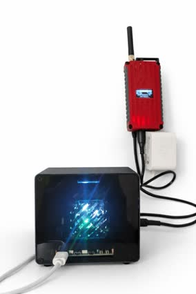
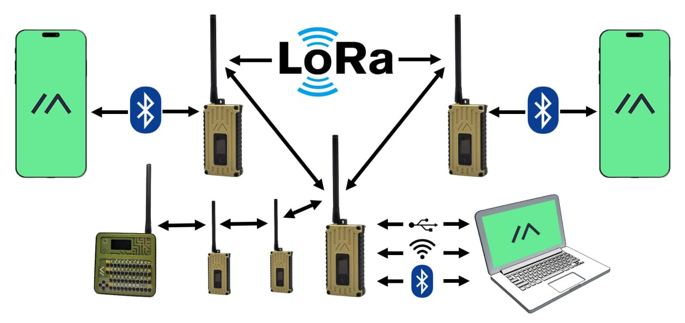

# meshtastic-skill

OpenClaw Meshtastic Off-grid radio skill for sovereign AI. LoRa mesh comms via Meshtastic — no internet required.



*Raspberry Pi 5 running OpenClaw + meshtastic-skill, connected to RAK4631 Meshtastic node — the sovereign radio stack*

## Overview

Connect AI agents to [Meshtastic](https://meshtastic.org) LoRa mesh networks. Send messages, monitor traffic, and stay connected when the internet isn't an option.

- 📡 **Send/receive** via LoRa mesh
- 🌐 **Global traffic** via MQTT bridge
- 🗺️ **Map integration** with privacy fuzzing
- 🔔 **Alerts & digests** for interesting messages
- 🛠️ **Framework-agnostic** core, AI-native design

## What is LoRa Mesh?



**LoRa** (Long Range) is a radio protocol designed for low-power, long-distance communication. **Meshtastic** turns LoRa radios into a decentralized mesh network:

- **No infrastructure needed** — nodes talk directly to each other via radio waves
- **Multi-hop routing** — messages bounce through intermediate nodes to extend range
- **Multiple interfaces** — connect via Bluetooth, WiFi, USB, or serial
- **Kilometers of range** — typical 5-10km line-of-sight, 1-3km urban
- **License-free** — operates on ISM bands (868 MHz EU / 915 MHz US)

Each node is both a radio and a router. Your AI connects to a local node (via USB in this skill), which relays messages across the mesh. No cell towers, no internet, no accounts — just radio waves and cryptography.

## Architecture

```
                         MQTT Broker
                    (mqtt.meshtastic.org)
                            |
                            | Global mesh traffic
                            v
+----------------------------------------------------------+
|                      Your Machine                        |
|                                                          |
|  +-----------+    +----------------+    +-------------+  |
|  | AI Agent  |<-->|  MQTT Bridge   |<-->|  LoRa Node  |  |
|  | (OpenClaw)|    |                |    | (USB/Serial)|  |
|  +-----------+    | - MQTT client  |    +-------------+  |
|       |           | - Socket :7331 |          |          |
|       |           | - Message log  |          |          |
|       v           +----------------+          v          |
|  localhost:7331         |              Radio Waves       |
|  (send commands)        v              (915/868 MHz)     |
|                  /tmp/mesh_*.txt                         |
+----------------------------------------------------------+
                                                |
                                                v
                                        +-------------+
                                        | Mesh Network|
                                        | (The World) |
                                        +-------------+
```

### Data Flow

**Outbound (AI → Mesh):**
```
Agent calls mesh.py send "hello"
  → Socket command to bridge (:7331)
  → Bridge sends via Meshtastic serial
  → Node transmits over LoRa
  → Mesh receives worldwide
```

**Inbound (Mesh → AI):**
```
Mesh message broadcast
  → MQTT broker receives
  → Bridge subscribes & logs to /tmp/mesh_messages.txt
  → Agent reads via mesh.py messages
  → Process, filter, respond
```

### Components

| Component | Purpose | Location |
|-----------|---------|----------|
| `mesh.py` | CLI for agents | `scripts/mesh.py` |
| `mcp_server.py` | MCP server for Claude Desktop | `scripts/mcp_server.py` |
| `mqtt_bridge.py` | MQTT↔Socket↔Serial bridge | `scripts/mqtt_bridge.py` |
| `mesh_monitor.py` | Alert filtering | `scripts/mesh_monitor.py` |
| `mesh_digest.py` | Periodic summaries | `scripts/mesh_digest.py` |

### Design Principles

1. **Async by default** — LoRa is slow (seconds to minutes). Fire-and-forget sends, queue-based receives.

2. **Socket API** — Simple JSON over TCP. Language-agnostic. Any agent framework can integrate.

3. **File-based logs** — `/tmp/mesh_messages.txt` is the inbox. Easy to tail, grep, or parse.

4. **Privacy-first** — Position fuzzing, no precise coords in broadcasts, map publishing is opt-in.

5. **Offline-capable** — Works without internet if you have local mesh peers.

## Quick Start

```bash
# Check bridge status
./scripts/mesh.py status

# View recent messages
./scripts/mesh.py messages

# Send to mesh
./scripts/mesh.py send "Hello from the sovereign zone!"

# List known nodes
./scripts/mesh.py nodes
```

## Installation

See [references/SETUP.md](references/SETUP.md) for complete guide.

**Summary:**
1. Connect Meshtastic hardware (RAK4631, T-Beam, etc.) via USB
2. Create Python venv, install dependencies:
   ```bash
   pip install meshtastic paho-mqtt
   pip install mcp  # optional, for MCP integration
   ```
3. Configure and start `mqtt_bridge.py` as systemd service
4. Edit `CONFIG.md` with your settings
5. Test with `mesh.py status`

## Configuration

Edit `CONFIG.md`:
- Node identity (name, short name)
- Serial port (`/dev/ttyACM0`, etc.)
- MQTT broker settings
- Socket port (default: 7331)
- Privacy settings (position fuzzing level)

## Socket API

Send JSON commands to `localhost:7331`:

```bash
# Status
echo '{"cmd":"status"}' | nc -w2 localhost 7331

# Send message
echo '{"cmd":"send","text":"Hello mesh!"}' | nc -w2 localhost 7331

# Send to specific node
echo '{"cmd":"send","text":"Hi","to":"!abcd1234"}' | nc -w2 localhost 7331
```

Response format:
```json
{"ok": true, "sent": "Hello mesh!"}
{"ok": false, "error": "No connection"}
```

## Message Log Format

`/tmp/mesh_messages.txt`:
```
2026-02-03T12:34:56|LongFast|!abc123|1542km|Hello world!
2026-02-03T12:35:01|ShortFast|!def456|892km|Testing 123
```

Fields: `timestamp|channel|sender|distance|text`

## Supported Hardware

| Device | Connection | Notes |
|--------|------------|-------|
| RAK4631 | USB | Recommended, reliable |
| T-Beam | USB | Built-in GPS |
| Heltec V3 | USB | Budget-friendly |
| LilyGo T-Echo | USB | E-paper display |

> ⚠️ **BLE not recommended on Linux/Pi** — BlueZ has known issues with Meshtastic (notification bugs, random disconnects, device stops advertising). Use USB serial instead.

## AI Framework Integration

### OpenClaw
Use `SKILL.md` directly — it's written for OpenClaw agents.

### MCP (Model Context Protocol)
For Claude Desktop and other MCP-compatible clients:

```bash
# Install dependencies
pip install mcp meshtastic

# Test connections (bridge + device)
python scripts/mcp_server.py --test
```

Add to Claude Desktop config:
- **macOS**: `~/Library/Application Support/Claude/claude_desktop_config.json`
- **Linux**: `~/.config/claude/claude_desktop_config.json`

```json
{
  "mcpServers": {
    "meshtastic": {
      "command": "python",
      "args": ["/path/to/meshtastic-skill/scripts/mcp_server.py"]
    }
  }
}
```

See `references/claude_desktop_config.json` for example.

#### MCP Tools

**Messaging** (via bridge):
| Tool | Description |
|------|-------------|
| `mesh_send` | Send message to mesh (broadcast or DM) |
| `mesh_send_alert` | Send high-priority alert message |
| `mesh_messages` | Get recent messages with filtering |

**Network Info** (via bridge):
| Tool | Description |
|------|-------------|
| `mesh_status` | Check bridge connection status |
| `mesh_nodes` | List all discovered mesh nodes |

**Device Info** (direct connection):
| Tool | Description |
|------|-------------|
| `mesh_device_info` | Get local device details (battery, hardware, etc.) |
| `mesh_channels` | List configured channels |
| `mesh_node_info` | Get detailed info about a specific node |

**Location** (direct connection):
| Tool | Description |
|------|-------------|
| `mesh_send_position` | Broadcast GPS position (use fuzzy coords!) |

**Telemetry & Diagnostics** (direct connection):
| Tool | Description |
|------|-------------|
| `mesh_request_telemetry` | Request battery/metrics from nodes |
| `mesh_traceroute` | Trace route and signal quality to a node |

**Device Management** (direct connection):
| Tool | Description |
|------|-------------|
| `mesh_reboot` | Reboot the connected device |

The MCP server uses **hybrid architecture**: messaging goes through the socket bridge (for MQTT integration), while device operations connect directly to the Meshtastic hardware.

### Other Frameworks
The core is framework-agnostic:
- `mesh.py` — standard CLI tool
- Socket API — JSON over TCP, works from any language
- MCP server — for MCP-compatible agents
- Adapt `SKILL.md` patterns to your agent's instruction format

## Privacy & Security

- **Position fuzzing**: Configurable ~2km grid snapping
- **Map opt-in**: Disabled by default, toggle with `mesh.py map`
- **No PII in code**: All personal data in `CONFIG.md` (gitignored)
- **Local logs**: Message history stays on your machine

## Commands Reference

| Command | Description |
|---------|-------------|
| `mesh.py status` | Bridge & node status |
| `mesh.py messages [-l N]` | Last N messages (default 20) |
| `mesh.py send "text"` | Broadcast to default channel |
| `mesh.py send "text" -c 1` | Send to channel 1 |
| `mesh.py send "text" -t !id` | Direct message |
| `mesh.py nodes` | List discovered nodes |
| `mesh.py map [--on/--off]` | Toggle map visibility |
| `mesh.py setup` | Interactive setup wizard |

## File Structure

```
meshtastic-skill/
├── README.md                 # This file
├── SKILL.md                  # AI agent instructions (OpenClaw)
├── CONFIG.md                 # User configuration template
├── scripts/
│   ├── mesh.py               # CLI tool
│   ├── mcp_server.py         # MCP server for Claude Desktop etc.
│   ├── mqtt_bridge.py        # MQTT↔Socket bridge
│   ├── mesh_monitor.py       # Alert filtering
│   └── mesh_digest.py        # Digest generator
└── references/
    ├── SETUP.md              # Installation guide
    ├── meshtastic-bridge.service  # systemd template
    └── claude_desktop_config.json # MCP config example
```

## License

MIT

## Links

- [Meshtastic Docs](https://meshtastic.org/docs/)
- [OpenClaw](https://github.com/openclaw/openclaw)
- [ClawdHub](https://clawdhub.com)
